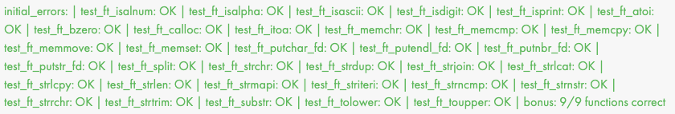

# Libft

Premier projet de 42 dont le but est de recréer une version simplifiée de la Libc. 

#### Construction du projet :

Arguments makefiles disponibles : `make all`, `make clean`, `make fclean`, `make re`, `make bonus`. 

#### Functions contenues dans cette blibliothèque :

* ft_isalpha
* ft_isdigit
* ft_isalnum
* ft_isascii
* ft_isprint
* ft_strlen
* ft_memset
* ft_bzero
* ft_memcpy
* ft_memmove
* ft_strlcpy
* ft_strlcat
* ft_toupper
* ft_tolower
* ft_strchr
* ft_strrchr
* ft_strncmp
* ft_memchr
* ft_memcmp
* ft_strnstr
* ft_atoi
* ft_calloc
* ft_strdup
* ft_substr
* ft_strjoin
* ft_strtrim
* ft_split
* ft_itoa
* ft_strmapi
* ft_striteri
* ft_putchar_fd
* ft_putstr_fd
* ft_putendl_fd
* ft_putnbr_fd
* ft_lstnew
* ft_lstadd_front
* ft_lstsize
* ft_lstlast
* ft_lstadd_back
* ft_lstdelone
* ft_lstclear
* ft_lstiter
* ft_lstmap

#### Correction automatique (moulinette) :
---

  |  |
---|---|